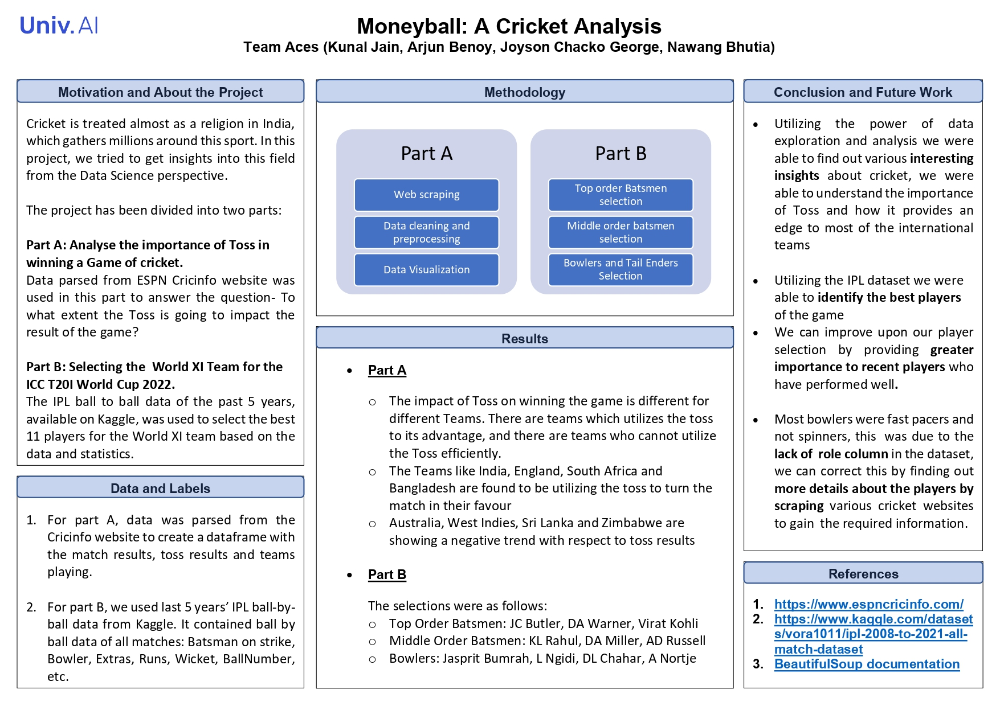

# Moneyball-a-Cricket-Analysis

## Project Description

This project delves into cricket analytics with a dual focus: evaluating the impact of the toss on match outcomes and selecting an ideal World XI team for the ICC T20I World Cup-2022. The analysis is split into two main parts:

### Part A: Impact of Toss on Winning a Game of Cricket

This section investigates how winning the toss affects the chances of winning a cricket match. The analysis steps include:

- **Data Scraping:** Data is collected from ESPN CricInfo using BeautifulSoup.
- **Data Cleaning and Preprocessing:** The raw data is cleaned and preprocessed to ensure accuracy and reliability.
- **Visualization and Conclusions:** Various visualizations are created to illustrate findings, and conclusions are drawn based on the data.

**Key Observations:**
- The impact of the toss varies by team.
- England, Bangladesh, and South Africa leverage the toss effectively.
- Australia, West Indies, and Sri Lanka need to improve their strategy post-toss.
- India performs well both when winning and losing the toss, indicating a strong overall strategy.

### Part B: Selecting World XI for ICC T20I World Cup-2022

This section aims to build the best possible cricket team for the ICC T20I World Cup-2022 by analyzing players' performances in the IPL. The steps include:

- **Data Source:** The IPL ball-by-ball dataset from Kaggle.
- **Data Cleaning and Preprocessing:** Ensuring the dataset is ready for analysis.
- **Player Selection Criteria:** Identifying top players based on specific performance metrics.

**Player Selection Insights:**

- **Best Openers:** Aggressive batsmen with high strike rates are chosen. JC Butler and DA Warner are selected based on their powerplay performance.
- **Anchor Batsman:** A reliable player with a good strike rate and experience is crucial. Virat Kohli is chosen for his consistency.
- **Middle Order Players:** Ideal candidates have high averages, strike rates, and perform well in death overs. KL Rahul, DA Miller, and AD Russell fit these criteria.
- **Best Bowlers:** 
  - Highest wicket-takers: Jasprit Bumrah and K Rabada.
  - Best economy rate: Rashid Khan.
  - Best bowling average: Mohsin Khan.
  - Best strike rate: L Ngidi.
  - Death Bowler King: A Nortje for his efficiency in the last few overs.
  - PowerPlay Wizard: Deepak Chahar for his performance in the first six overs.

### Conclusion and Future Work

The project demonstrates the power of data exploration and analysis in uncovering valuable insights about cricket. Key takeaways include:

- The importance of the toss and its strategic use by different international teams.
- The identification of top players using detailed performance metrics.
- Future improvements could include giving more weight to recent performances, enhancing player role identification, and expanding data scraping efforts to gather more comprehensive information.

By leveraging data analytics, we can better understand and strategize cricket matches, leading to more informed decisions and potentially greater success on the field.
